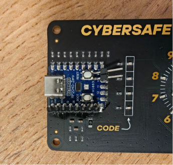
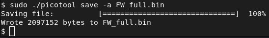
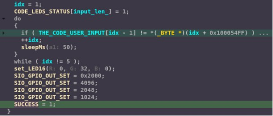
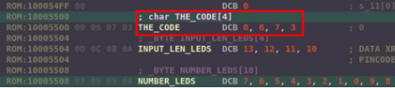
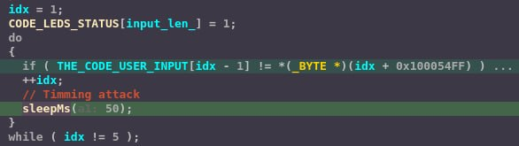
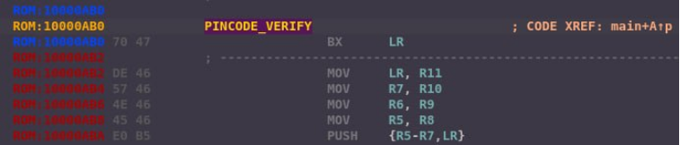
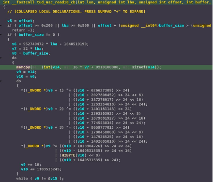
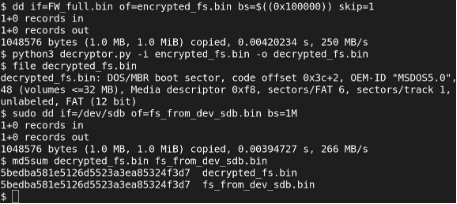

## Содержание

- [Сводная таблица уязвимостей](#сводная-таблица-уязвимостей)
- [Реверс-инжиниринг прошивки](#реверс-инжиниринг-прошивки)
- [Уязвимость 1. Доступ к прошивке через BOOTSEL](#уязвимость-1-доступ-к-прошивке-через-bootsel)
- [Уязвимость 2. Хранение пароля в открытом виде](#уязвимость-2-хранение-пароля-в-открытом-виде)
- [Уязвимость 3. Атака по времени (Side-channel)](#уязвимость-3-атака-по-времени-side-channel)
- [Уязвимость 4. Отсутствие защиты от модификации](#уязвимость-4-отсутствие-защиты-от-модификации)
- [Уязвимость 5. Ненадёжное шифрование накопителя](#уязвимость-5-ненадёжное-шифрование-накопителя)
- [Артефакты](#артефакты)

---

## Сводная таблица уязвимостей

| № | Описание вектора атаки | Классификация | Оценка сложности |
|---|---|---|---|
| 1 | **Доступ к прошивке через BOOTSEL.** Злоумышленник может перевести микроконтроллер в режим BOOTSEL и через интерфейс USB Type-C считать полный дамп Flash-памяти. | Аппаратная | Низкая |
| 2 | **Хранение пароля в открытом виде.** Злоумышленник может получить дамп прошивки и извлечь значение пароля, хранящегося в открытом виде. | Программная | Средняя |
| 3 | **Атака по времени.** Злоумышленник может осуществлять ввод цифр и регистрировать время отклика устройства на каждом шаге. Поскольку после успешного сравнения каждой цифры выполняется задержка 50 мс, суммарное время обработки зависит от количества верно введённых символов. Анализ временных характеристик позволяет последовательно восстановить полное значение пароля. | Side-channel | Высокая |
| 4 | **Отсутствие защиты от модификации.** Злоумышленник может модифицировать прошивку и загрузить изменённый образ на устройство. Поскольку микроконтроллер не выполняет проверку подписи или целостности прошивки, модифицированный образ успешно загружается. Уязвимость позволяет обойти процедуру ввода пароля или выполнить произвольный код на устройстве. | Программная | Средняя |
| 5 | **Использование ненадёжных или устаревших алгоритмов шифрования.** Злоумышленник может получить дамп прошивки, восстановить по функции `tud_msc_read10_cb` алгоритм потокового XOR-шифрования и расшифровать содержимое накопителя без ввода пароля. | Программная | Средняя |

---

## Реверс-инжиниринг прошивки

### Аппаратный анализ

- Изучены расположение компонентов, маркировка и выведенные контакты микроконтроллера.
- Идентифицирован микроконтроллер — **Raspberry Pi RP2040-Zero**.
- Найдена официальная документация — **RP2040 Datasheet**.
- Выполнен монтаж дополнительных контактов к выводам микроконтроллера для удобства работы.



### Считывание прошивки через Type-C

Для работы с устройством использована официальная утилита **picotool**.

```bash
sudo ./picotool save -a FW_full.bin
sudo ./picotool save FW.uf2
python3 uf2conv.py FW.uf2 -o FW.bin
```

Устройство переведено в режим **BOOTSEL** (кнопка BOOT + RESET) и считано как USB-накопитель. Получен полный дамп Flash-памяти (`FW_full.bin`).



### Извлечение пароля из прошивки

При анализе прошивки в IDA Pro был обнаружен алгоритм проверки



А также пароль в открытом виде по адресу **`0x10005500`**:



После ввода пароля на плате загорелся зелёный светодиод и был инициализирован Flash-накопитель **«PositiveLabs RP2040 Flash MSC»** с содержимым `layers.zip` и `readme.txt`. При распаковке 1337 архивов был получен файл prize.html.


---

## Уязвимость 1. Доступ к прошивке через BOOTSEL

**Классификация:** аппаратная

**Сложность эксплуатации:** низкая

### Вектор атаки

Злоумышленник, имеющий физический доступ к устройству, может перевести микроконтроллер в режим BOOTSEL и через интерфейс USB Type-C считать полный дамп Flash-памяти.

### Шаги по воспроизведению

1. Удерживая кнопку **BOOT**, подать питание.
2. Устройство определится как USB-накопитель.
3. Считать дамп командой:

```bash
./picotool save -a FW_full.bin
```

### Подтверждение доступа


---

## Уязвимость 2. Хранение пароля в открытом виде

**Классификация:** программная

**Сложность эксплуатации:** средняя

### Вектор атаки

Злоумышленник может получить дамп прошивки и извлечь значение пароля, хранящегося в открытом виде.

### Шаги по эксплуатации

1. Открыть `FW_full.bin` в IDA Pro.
2. Методами реверс-инжиниринга обнаружить функцию `PINCODE_VERIFY`.
3. Получить адрес пароля из цикла проверки и считать значение `THE_CODE`.

```
ROM:10005500 THE_CODE DCB 0, 6, 7, 3
```

### Подтверждение доступа


---

## Уязвимость 3. Атака по времени (Side-channel)

**Классификация:** side-channel (timing attack)

**Сложность эксплуатации:** высокая

### Вектор атаки

Злоумышленник может осуществлять ввод цифр и регистрировать время отклика устройства на каждом шаге. Поскольку после успешного сравнения каждой цифры выполняется задержка **50 мс**, суммарное время обработки зависит от количества верно введённых символов. Анализ временных характеристик позволяет последовательно восстановить полное значение пароля.

### Шаги по эксплуатации

1. Подключить внешнюю плату к устройству (напр. Raspberry Pi Pico).
2. Подключиться к контактам энкодера, светодиода и сброса.
2. Запустить скрипт **src/timming_attack.py** на внешней плате командой **mpremote run src/timming_attack.py**

**Уязвимый фрагмент кода:**



**Результат:** пароль подобран за **40 попыток** вместо 10 000 полного перебора (~250× быстрее). Итоговое время работы эксплойта **~55 секунд**.

### Подтверждение доступа

- 📹 [Видеодемонстрация](videos/timming_attack.mp4)

---

## Уязвимость 4. Отсутствие защиты от модификации

**Классификация:** программная

**Сложность эксплуатации:** средняя

### Вектор атаки

Злоумышленник может модифицировать прошивку и загрузить изменённый образ на устройство. Поскольку микроконтроллер не выполняет проверку подписи или целостности прошивки, модифицированный образ успешно загружается. Уязвимость позволяет обойти процедуру ввода пароля или выполнить произвольный код на устройстве.

### Шаги по эксплуатации

1. В файле прошивки заменить первую инструкцию функции `PINCODE_VERIFY` на `BX LR` (`70 47`).



2. Сохранить как `FW_patched.bin`.
3. Загрузить модифицированный образ:

```bash
./picotool load FW_patched.bin
```

### Подтверждение доступа

- 📹 [Видеодемонстрация](videos/modify.mp4)

## Уязвимость 5. Ненадёжное шифрование накопителя

**Классификация:** программная

**Сложность эксплуатации:** средняя

### Вектор атаки

Злоумышленник может получить дамп прошивки, восстановить по функции `tud_msc_read10_cb` алгоритм потокового XOR-шифрования и расшифровать содержимое накопителя без ввода пароля.

### Шаги по эксплуатации

1. Вырезать из дампа прошивки область зашифрованного раздела накопителя по смещению 0x100000 командой:

```bash
dd if=FW_full.bin of=encrypted_fs.bin bs=$((0x100000)) skip=1
```

2. Запустить скрипт **src/decryptor.py** командой:

```bash
python3 decryptor.py -i encrypted_fs.bin -o decrypted_fs.bin
```

**Фрагмент кода:**



**Результат:** расшифрованное содержимое полностью совпало с содержимым накопителя после ввода пароля.

### Подтверждение доступа



---